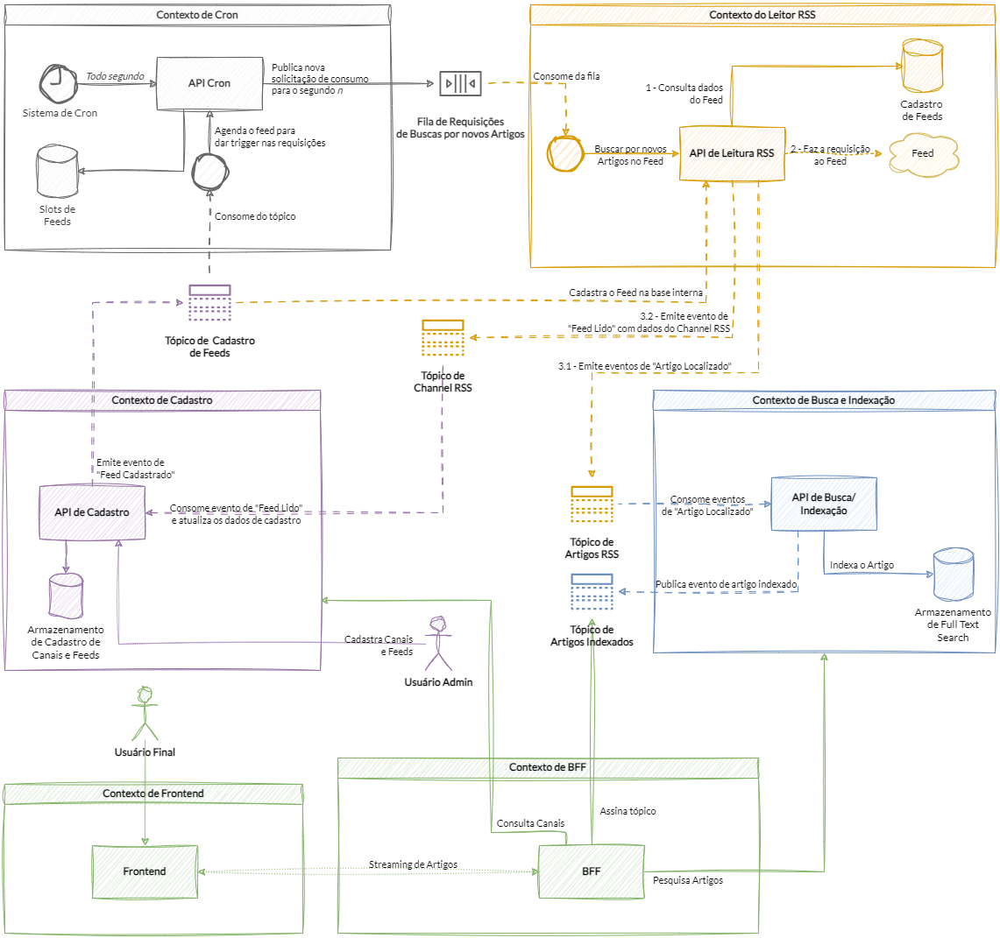

# TCC de Pós-graduação PUCRS (Desenvolvimento Full Stack)

Por Mateus Canello Ottoni

## Objetivo

Criação de produto de software _full stack_ com o objetivo de exercitar a comunicação via eventos entre sistemas (microsserviços).

## Stack

Backend em .Net (.Net 6) + frontend em ReactJS.

Utiliza Docker Compose para execução das aplicações.

Utiliza SignalR para _streaming_ de dados do backend para o frontend.

Utiliza Dapr (dapr.io) para abstração de infraestrutura e implementação de Cron.

### Serviços

A solução utiliza das seguintes tecnologias de armazenamento para persistência de dados:

* Redis (_state_ e cache)
* Apache Kafka (eventos)
* ElasticSearch (indexamento e busca de documentos)

Ao executar o Docker Compose, containers para essas três tecnologias são automaticamente criados e configurados.

## Solução

Trata-se de uma solução de agregador de notícias.

O frontend da aplicação apresenta os artigos de notícias que foram descobertos e indexados a partir de leituras de _feeds_ RSS.

Uma versão publicada da aplicação pode ser acessada em <https://newsfeed.tec.br/>.

Na versão publicada, algumas das tecnologias especificadas anteriormente são substituídas por outras por conveniência de cloud.

## Executando a solução

Para executar a solução, basta rodar o seguinte comando no diretório raiz do repositório:

```shell
docker-compose -f ".\code\docker-compose\docker-compose.yml" -p newsfeed --ansi never up -d
```

A execução do comando pode levar diversos minutos, especialmente na primeira execução, para que o Docker tenha tempo de baixar e compilar todas as diversas imagens de containers utilizadas pela solução.

Também é possível executar a solução via Visual Studio. Para isso, basta abrir a _solution_ no VS e executar o projeto Docker Compose como projeto inicial. Ao executar via Visual Studio, o nome do projeto (`-p`) será diferente de `newsfeed` (como está via linha de comando).

### Portas das Aplicações

As aplicações da solução executam em portas fixas:

* Frontend: <http://localhost:5173/>
* BFF: <http://localhost:5191/>
* Leitor RSS: <http://localhost:64705/>
* Cron API: <http://localhost:64706/>
* Admin API: <http://localhost:64707/>
* Search API: <http://localhost:64708/>

### Demais Containers

* ElasticSearch: <http://localhost:9200/>
* Kibana: <http://localhost:5601/>
* Apache Kafka: `localhost:9092`
* Redis: `localhost:6379`

### Observações (portas)

Caso alguma das portas utilizadas por algum dos containers da solução já esteja em uso por outra aplicação no computador onde se estiver rodando o `docker-compose`, ocorrerá falha ao tentar executar a solução.

## Arquitetura

### Diagrama geral da solução



## Primeiros passos

Nenhuma informação é pré-carregada na solução. Portanto, após executar a solução pela primeira vez, não existirá nenhum canal cadastrado, bem como nenhum artigo estará disponível para exibição no frontend da aplicação.

Portanto, após as aplicações estarem rodando, sugere-se realizar os primeiros cadastros de _feeds_ RSS que se deseja consumir. Exemplos:

### Cadastrando um Canal

Um canal na solução representa um "agrupador de _feeds_ RSS". Essa entidade se faz necessário porque diversos portais de notícias possuem _feeds_ RSS específicos, normalmente por categoria (por exemplo, uma URL de _feed_ RSS específica para esporte, outra URL específica para saúde, outra específica para cultura, etc.).

Como se deseja apresentar todos os artigos retornados por quaisquer _feed_ daquele canal como se fosse um único canal, se criou a estrutura de Canal para agrupar esses diversos possíveis _feeds_ de um mesmo emissor.

O cadastro de um Canal deve ser realizado na API de Admin.

Exemplo:

```http
POST /create-channel HTTP/1.1
Host: localhost:64707
Accept: application/json
Content-Type: application/json

{
  "channelId": "the-guardian",
  "data": {
    "name": "The Guardian",
    "url": "https://www.theguardian.com/"
  }
}
```

### Cadastrando um Feed RSS

Um canal é um agrupador de _feeds_ RSS. Mas um canal, por si só, não vai trazer nenhuma informação de artigo. Para que a solução consuma os artigos de um portal de notícias, deve-se cadastrar um (ou mais) _feed_ RSS para o canal cadastrado.

O cadastro do _feed_ RSS também deve ser feito na API de Admin.

Exemplo:

```http
POST /create-feed HTTP/1.1
Host: localhost:64707
Accept: application/json
Content-Type: application/json

{
  "feedId": "the-guardian-uk",
  "channelId": "the-guardian",
  "url": "https://www.theguardian.com/uk/rss"
}
```

No cadastro do _feed_, deve-se apresentar no campo URL a URL que de fato retorna o _feed_ RSS a ser consumido periodicamente.

A API de Admin, que recebe a requisição de cadastro do _feed_, emite um evento de que um novo _feed_ foi cadastrado. Esse evento é recebido pelas demais aplicações (Cron e Leitor RSS) que registram essas informações.

A partir desse cadastro do _feed_ RSS, o sistema irá passar a periodicamente consultar essa URL para descobrir novos artigos.

Ao identificar novos artigos, o frontend da aplicação irá passar a receber as notificações do SignalR e apresentar para o usuário que novos artigos foram recebidos.